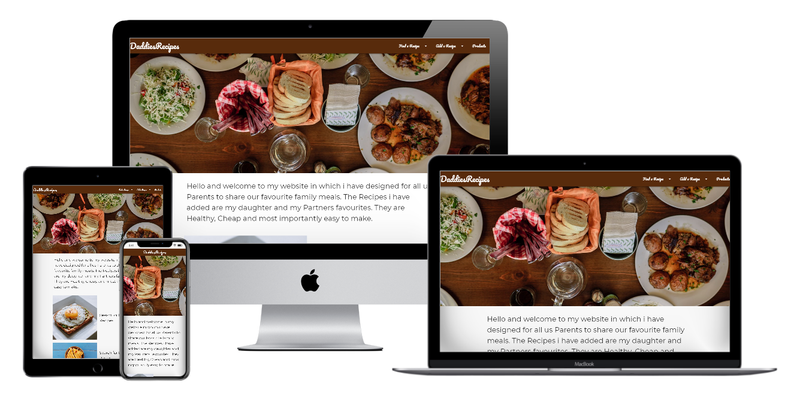
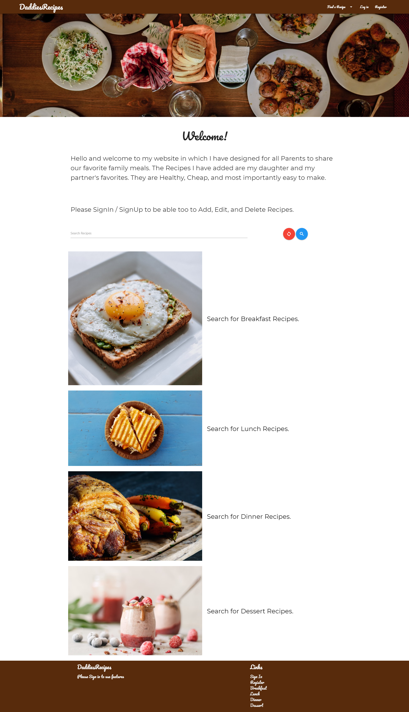
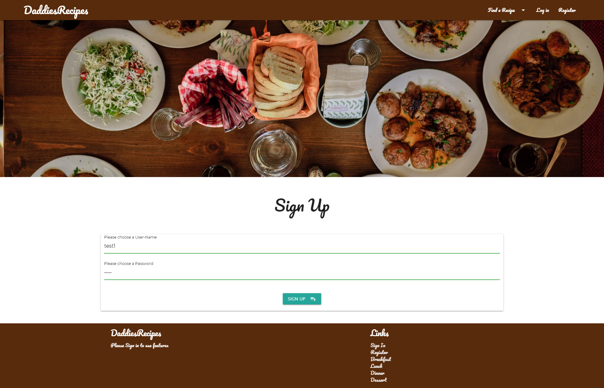
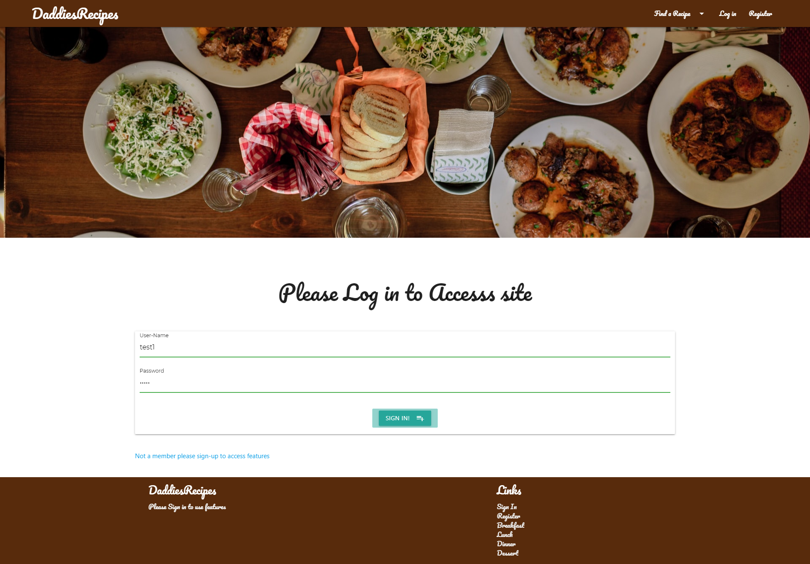
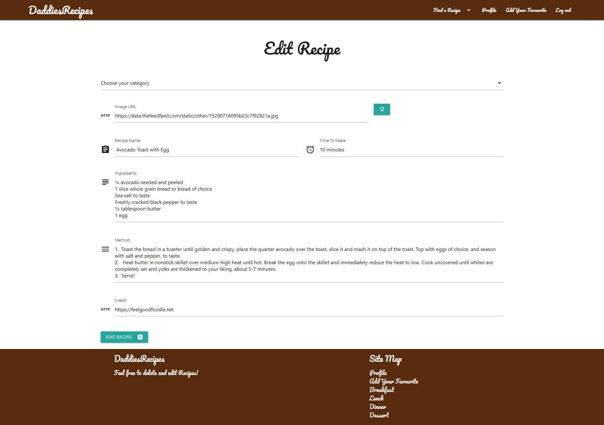
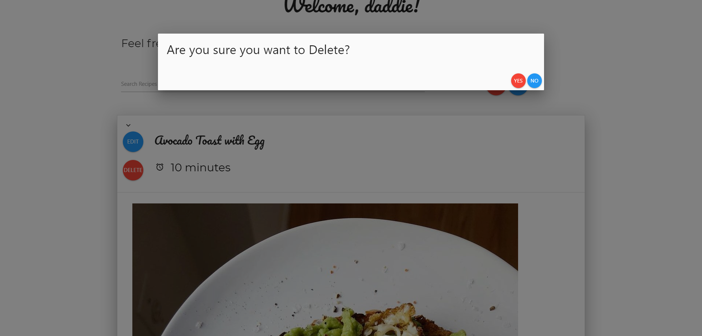
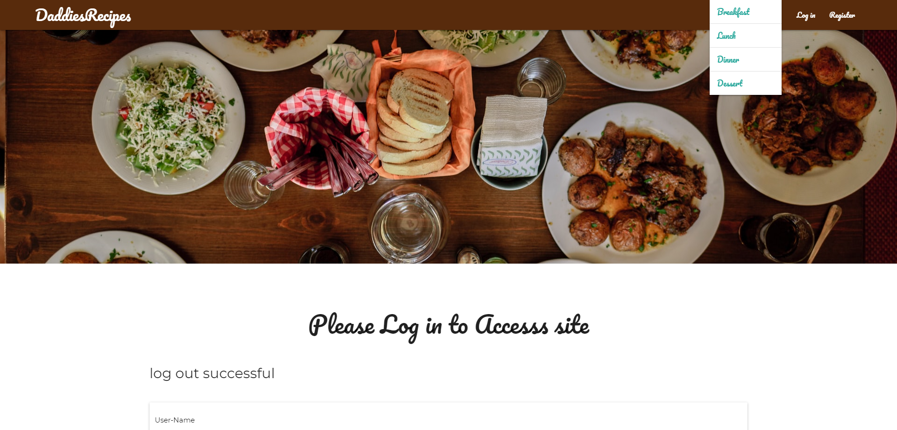
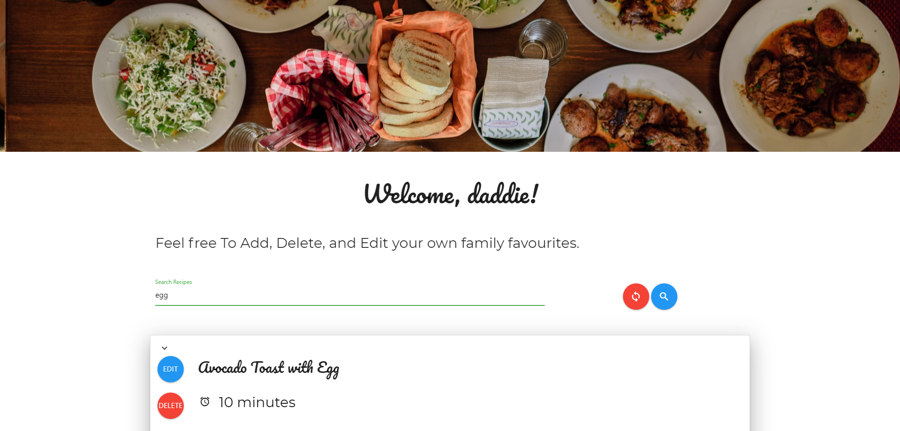
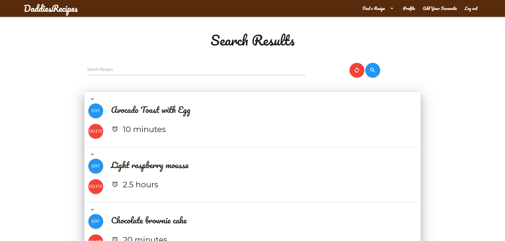

# Daddies Recipes 

Please find the application here: http://daddiesrecipes.herokuapp.com/home

# Important Information

I made this app in another repo but i made the big mistake on what a developer can do and i commited my API key and SECRET key so to fix this i made a new REPO 

## Table of Contents
1. [**About**](#about)
2. [**UX**](#ux)
3. [**Existing Features**](#existing-features)
4. [**Database Schema**](#database-schema)
5. [**Testing**](#testing)
6. [**Deployment**](#deployment)
7. [**Credits**](#credits)

## About
This is a website that allows users to:

* See Recipes

* Edit Recipes 

* Add Recipes 

* Delete Recipes

As a Dad and an ex-chef, I am always cooking for my family in a nutritious way, so I decided to make a website that shares my recipes and allows other people to share their family favorites.

## UX

### Wireframes

Please view the wireframes [here](Wireframes/daddies.pdf)

### This website is for:

* Families 
* Careers
* Grandparents
* Cooks
* Chefs

### What they want to achieve:

* Sign up to use the create edit and delete functions on the website

* Learn What the website is about 

* Look for recipes in a clear format i.e. in clear sections breakfast, lunch, dinner, dessert

* Search for recipes by typing a query into a search bar by ingredient or title

* Add their family favourites 

* Edit Recipes if they know a better version or make a mistake

* Delete a Recipe if there are duplicates 

*	(Most important) do it in a time efficient way 

### How will they achieve it:
* By making my website mobile-first I can achieve a suitable layout of the website across all platforms just for the instance a user looks at it on mobile/tablet/desktop

* The first page will contain the website features

* There will be different pages so a user can jump from to the most relevant information

* There will be a search bar to search for recipes
* There will be a profile page where the user can only edit and delete there own recipes
* There will be clear buttons for Deleting and Editing Recipes
* There will be a clear form to add/edit recipes with sections for image URL, recipe name, time to make the recipe, ingredients, method
* There will be a sign-in page so they can access the said functions 

## Existing Features 
*	Navigation bar- allows all users to select the content they want to view by simply clicking them, this also collapses into a toggle on mobile devices to maintain space

* Subheadings-this allows users to find the information they need
* Sign in / sign up page – this allows the user to sign up to use features
* A search bar - so the user can find recipes
* An accordion-style recipe page – so the user can click on their chosen recipe and can view it
* A delete button – which is clear and red so a user can click and delete the recipe
* An edit button- this takes the user to the edit form which they can fill out and edit the recipe and is taken back to the recipe page once complete
* A add a recipe page so the user can add their recipe
* A 404 handler so the user doesn't have to use the back buttons on the browser
### Features I would like

*   Ability to add an image to the database from the user’s files e.g. a jpeg 
### Technologies used
*	HTML5- the standard language of a webpage

* CSS3- for customised styling
* jQuery – for styling options like navbar, the images, accordion
* Flask- this was used for template inheritance and to view the data in a clear and styled manner
* Python3 – for loading the HTML pages, accessing the mongo dB database and displaying
* mongo dB – this is the database system that I used to store all data and then display it on the website
* Materialize – I used this for the styling of the webpage and to make it more responsive
## Database Schema

### Users 

Key | Value
------------ | -------------
_id | ObjectID
user | string
password | string

### Recipes

Key | Value
------------ | -------------
_id | ObjectID
type | string
image | string
recipe_name | string
time_to_make | string
Ingredients | string
method | string 
posted_by | string ( retreved by user in session)
credit | string

## Testing 
I viewed the webpage in the browser and used google developer tools to make sure the project looks good, works on all devices and if any bugs appeared when I implemented each section of the code. I also had a Debugger on the python file which flagged any bugs in my console window and had helpful hints on how to fix these
I also Learnt about a webpage auditor called Lighthouse I put my deployed webpage through that, and this was the score

The things that are marking this app down are: 

The things that are marking this app down are:

* Lighthouse is looking for the HTML tags on all pages but due to me using flask this I do not need to be concerned about this

* The app doesnt use HTTPS which is something i would like to look into in the future when deploying as this is most secure

I tested each user story as follows:

* Learn What the website is about- Go to home page

*	Sign up to use the create edit and delete functions on the website  – Go to the website, click sign up, redirected to sign up page enter chosen username and password, redirected to sign in to enter the chosen username and password 

 
  

*  Add their family favourites- go to homepage, click the add a recipe section on navbar, dropdown appears with sections for breakfast, lunch, dinner. Select your choice, add a recipe page loads with a form to add an image, title, time to make, ingredients and method

  

*	Edit Recipes if they know a better version or make a mistake- Go to profile page see the recipes with a clear edit button and when clicked redirected to a form to edit said recipe 
  
    

*	Delete a Recipe if there are duplicates- Go to profile click delete  a modal pops up to confirm and then the profile page reloads with the recipe deleted

  
      
*	look for recipes in a clear format i.e. in clear sections breakfast, lunch, dinner, dessert – go to homepage, click the find a recipe section on navbar, dropdown appears with sections for breakfast, lunch, dinner 

  

*	 Search for recipes by typing a query into a search bar by ingredient or title - go to either the home or profile page and find the search bar , once typed in press serach and it will take you tto a serach page

  

  
  

*	Do in a time efficient way – everything is set out in headings and subheadings so the user can jump to necessarily information 

### I have tested this project on these devices: 

* iPhone 
* Laptop 
* Desktop 
* Tablet 
* Samsung S10

### Interesting Bugs and how I fixed it:

* I was trying to store all Recipes in one collection Which was making my laptop crash, so I decided to store them in collections of breakfast, lunch, dinner and dessert which fixed this issue and then i upgraded my computer
  and went back to using an all recipes collection. This has taught me RAM is everything 
* when I sent this for users to test they couldn’t sign up to the webpage , as I fixed this issue I realised I had both GET and POST actions on the form to fix this I removed the GET action and this fixed the issue
* The edit recipe page was not loading any javascript or my images im not sure of why this has happened but i removed the template inheritance and this fixed the issue 
### Validation

I also validated my code on W3C Mark-up Validator and pep8 for python validation 

## Deployment 

I Deployed my app on Heroku 

### This is how I did it 

 1.  Set up a Heroku account

 2. Create an application, this must be a unique name  

 3. Go to settings and set the VARS for IP and PORT, I set mine to IP-0.0.0.0 PORT-5000 

 4.  Go back to the terminal and type - “Heroku login” this will take you to a webpage to login to your Heroku account 

 5.  use “git init “to initialise and new repository

 6. type the command “pip3 freeze > requirements.txt” this will add a new2 file with all the packages to run your python app 

7.  create a profile “echo web: python run.py > Procfile” if your python file is called run.py

8. run the command “git remote add” and the app URL which can be found on the Heroku dashboard

8. do a “git add.”

9. commit your code ‘git commit -m” your message here”’ 
10. then run “git push Heroku master”
11. This will then deploy your app

When I deployed my project, I sent it to friends and family for feedback as further testing of the product.

## Credits 
### Code 
*	Code institute for the knowledge and use of there code practices and tutor support -https://courses.codeinstitute.net/login

*	Materialize- this helped with the styling and functionality of the site 
*    Python tester – validation of my app.py - https://extendsclass.com/python-tester.html
*   Pep8- http://pep8online.com/
*	W3schools – for tutorials and code uses -https://www.w3schools.com/ 
*   W3C CSS - validation of my CSS - https://jigsaw.w3.org/css-validator/
*   W3C - validation of my HTML - https://validator.w3.org/

### Media 
* lighthouse testing - https://web.dev/measure/?gclid=Cj0KCQjwuJz3BRDTARIsAMg-HxU3cY1mcAGoQ3I6EiLsIYgKsC9VLXVIW1FDcZM3Vjuj-Dkncprhz38aAh-bEALw_wcB
* I received my images from USPLASH which is a free image downloader and google image search - https://unsplash.com/
* Responsive image for README - http://techsini.com/multi-mockup/index.php

* Colors – I used this website for the navbar it is a website you can get the html code of an image https://html-color-codes.info/colors-from-image/.

### Acknowledgement

I got my inspiration from Code Institute 
